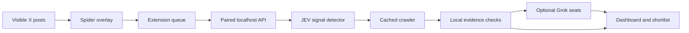

<p align="center"></p>

<p align="center">
  <a href="https://github.com/h100envy/gem-search/actions/workflows/ci.yml"></a>
  
  
  <a href="LICENSE"></a>
</p>

<p align="center"><b>A small spider for your feed. A research pipeline behind it.</b><br>Observe → connect the dots → follow the evidence → challenge the thesis.</p>
<p align="center"><a href="#quick-start">Get started</a> · <a href="docs/README.ru.md">Русский</a> · <a href="docs/ARCHITECTURE.md">Architecture</a> · <a href="docs/PRIVACY.md">Privacy</a></p>

## Meet your narrative spider

Gem Search puts an animated eight-legged research companion on your X feed. It walks between visible posts, highlights what it is inspecting, and sends a small capture to a research engine running on your computer.

**JEV** groups recurring topics and project links. **Crawler** reads public sites, repositories and docs. **Four Grok seats** challenge the evidence from different perspectives. Your dashboard keeps the sources, gaps and decisions together.

The spider is a browser overlay, not an operating-system desktop pet. It cannot walk outside the page or monitor another application. It doesn't like, reply, follow accounts or connect a wallet.

This is an open-source developer preview, not a promise of early alpha. A shortlist is a research lead, not proof of safety, originality or future returns.

## What it does

| Layer | Behavior |
| --- | --- |
| 🕷 Spider | Animated overlay, current-post highlight, capture counters, pause/dismiss, optional visible-tab auto-scroll |
| JEV | Local post deduplication, topic grouping, author diversity and repeated-text checks; English and Russian topic keywords |
| Crawler | Follows bounded public HTTP(S) links; caches pages for 30 minutes; blocks private-network targets |
| Grok seats | Four actual API requests with role-specific prompts, structured output and evidence references; optional |
| Dashboard | Filterable projects/narratives, local checks, Grok reasons, sources, persistent activity log and JSON export |
| Local queue | Survives extension worker suspension and backend restarts; bounded to avoid unlimited collection |
| Economy mode | No paid X API required to inspect the posts already visible in your browser; local rules work without Grok |

**JEV is our own signal detector**, not an integration with an unnamed external JEV product. Grok uses the official xAI API; this repository is not an official X/xAI extension. Reading the current DOM is not an X firehose or a substitute for a licensed data service.

## Quick start

Python **3.11+**, Chrome/Chromium. Backend: macOS, Linux, or Windows through WSL2. Node **22+** is needed only for the full test suite and optional Solana module; the research backend and extension need no npm build.

```sh
git clone https://github.com/h100envy/gem-search.git
cd gem-search
cp .env.example .env
python3 app.py
```

1. Open **http://127.0.0.1:8787**. Visit **Connections** and copy the local pairing code.
2. Open **chrome://extensions**, enable **Developer mode**, click **Load unpacked**, select this repository's **extension/** directory.
3. Open the Gem Search toolbar popup, paste the pairing code and click **Connect**.
4. Open an X feed, search or profile page. Click **Release spider on this tab**.
5. Scroll normally, or opt into auto-scroll. The spider only inspects rendered posts in the visible viewport. Pause or dismiss it at any time.

The local engine must stay running. If it is offline, up to 200 captured posts remain in the extension queue. The next successful connection forwards them. Background tabs do not collect or auto-scroll.

**Try the spider without an X account:** open **http://127.0.0.1:8787/spider-demo**. It uses the same spider renderer over fictional cards, makes no API calls and collects nothing. The dashboard's **Demo scan** separately exercises the research pipeline with clearly marked synthetic projects.

## Give it four Grok perspectives

Add your key **locally** to `.env`, then restart the engine:

```dotenv
GROK_ENABLED=1
XAI_API_KEY=your_local_api_key
GROK_MODEL=grok-4.7
GROK_DAILY_CALLS=12
```

| Seat | Question |
| --- | --- |
| **Lookout** | Is there a noteworthy signal in the observed sample? |
| **Maker** | What product or technical evidence is actually present? |
| **Skeptic** | What is contradictory, risky or still unverified? |
| **Runner** | Is there enough evidence to investigate this now? |

Reviews begin only after at least four distinct observed authors. One full review makes **four requests**, so the default limit permits at most **three full reviews per rolling 24 hours**, including failed calls. Results are cached for 24 hours for identical evidence/model inputs. Each request has bounded excerpts and a 700-token output limit. This is a request allowance, **not a guaranteed dollar cap**; your xAI plan determines charges. No xAI search tools are enabled.

Keys stay in the backend. Collected excerpts leave your computer **only when Grok is enabled**, sent to `api.x.ai` for analysis. Without a key, the UI shows local checks instead. An unavailable model, exhausted allowance, invalid response or invented citation cannot count as a pass. Model outputs cannot execute code, browse independently or control wallets.

The Grok adapter is implemented and covered by mocked tests. A real paid Grok call has **not** been validated in this checkout because no xAI key was provided.

## A transparent pipeline



A browser token can only submit captures and read scanner status. It cannot launch tokens. The extension has no account-action code and no xAI API key. See [architecture](docs/ARCHITECTURE.md) and [privacy](docs/PRIVACY.md).

## Other sources and optional launch module

- JSON import and `data/inbox/` support external collectors. See [data format](docs/DATA_FORMAT.md).
- `python3 app.py --autopilot` also enables the free Hacker News narrative scanner and inbox watcher. HN attention is labeled separately from X captures.
- Official X recent-search access remains optional and paid; `ENABLE_PAID_X=0` by default.
- The earlier experimental Pump.fun launcher remains available as a **separate opt-in module**, dry-run by default. Browser captures cannot enter it without `SPIDER_ALLOW_LAUNCH=1`.
- Its configured ceilings are 0.025 SOL per attempt and five attempts per rolling 24 hours. It is not required to use the spider. See [launch module](docs/AUTOLAUNCH.md) and [setup](SETUP.md).

## Package, test, contribute

```sh
npm ci --ignore-scripts
python3 -m unittest discover -s tests -v
npm test
python3 scripts/package_extension.py
```

The ZIP is written to `dist/gem-search-extension.zip`; it contains extension assets only. Extract it and load that directory as an unpacked extension. GitHub Actions also uploads the ZIP as a build artifact. This is **not** a Chrome Web Store listing.

Tests cover capture validation, route exclusions, deduplication, narratives, Grok caching/allowances/failures, local-network blocking, queue recovery, and optional transaction guards. They do not establish that every future X layout will work. Full browser installation and real-account capture still need manual QA against the current X markup. See [contributing](CONTRIBUTING.md).

## Project map

```text
extension/           Manifest V3 popup, worker, extractor and animated spider
jev.py               Local topic and project signal detector
grok.py              Four optional API reviewers + persistent request allowance
app.py               Local HTTP engine, crawler, dashboard and capture worker
static/              Research dashboard
docs/                Architecture, privacy, preview and launch documentation
scripts/             Icon generation and explicit-allowlist ZIP packaging
automation.py        Optional durable launch queue
launch/              Optional isolated-wallet Solana executor
tests/               Offline tests and unsigned provider fixture
```

## Limits worth understanding

X markup changes. The extractor uses rendered `article[data-testid="tweet"]`, text, timestamp permalinks and visible external anchors. Shortened `t.co` links aren't treated as verified project sites. Topic discovery uses a small, inspectable taxonomy; it can miss new memes, sarcasm and novel projects. A linked repository isn't proof of a functioning product. No model here detects every scam or bot ring.

The engine is local and single-user. Do not expose its port to the internet. Keys, wallet files, captured posts and SQLite are ignored by Git. Read [SECURITY.md](SECURITY.md) before changing trust boundaries.

MIT · Independent project. Not affiliated with X, xAI, Pump.fun or PumpPortal.
